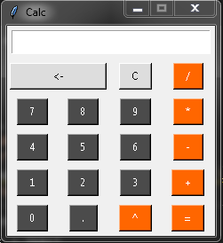

# Calculator App
A small python program that creates a calculator app

### Tech Stack:
+ Python 3

### To execute the project:
+ Run `calculator.py`

### Screenshot/GIF showing the sample use of the script
<!--Remove the below lines and add yours -->

