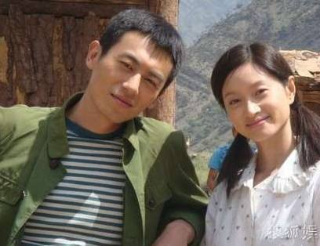

# Detect and align face
This algorithm can detect the faces from picture and then align them.

### Tech Stack:
+ Python

### Libraries used:
+ numpy
+ os
+ sys
+ cv2
+ dlib

###  Pre-requirements:
+ `pip install -r requirements.txt`
+ You should dowload the [model parameters](http://dlib.net/files/shape_predictor_68_face_landmarks.dat.bz2) 
from dlib, decompress and move to `./dat` 

### To execute the project:
+ Run `main.py`

<h3>Note:</h3> 
After the script finished, you will get some faces picture in the same
directory.

### Screenshot

