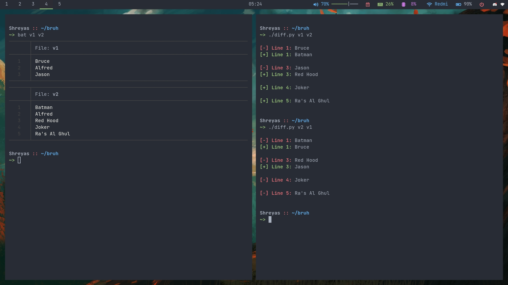

# Diff Utility
This program is a minimal clone of the UNIX ``diff`` program.

``diff.py`` takes two file names as command-line arguments and compares them for changes.

### Tech Stack:
+ Python 3

### Libraries used:
+ ruch `rich==10.11.0`

###  Pre-requirements:
+ `pip install rich`

### To execute the project:
1. Windows
+ Run `python diff.py <orignal_file> <changed_file>`

2. Linux / mac
+ Run `./diff.py <orignal_file> <changed_file>`

### Usage Example

Consider two files ``v1`` and ``v2``:

**v1**:
```
Bruce
Alfred
Jason
```

**v2**:
```
Batman
Alfred
Red Hood
Joker
Ra's Al Ghul
```

On running ``./diff.py v1 v2``, you'll get the following output:
```

[-] Line 1: Bruce
[+] Line 1: Batman

[-] Line 3: Jason
[+] Line 3: Red Hood

[+] Line 4: Joker

[+] Line 5: Ra's Al Ghul

```

### Screenshot

