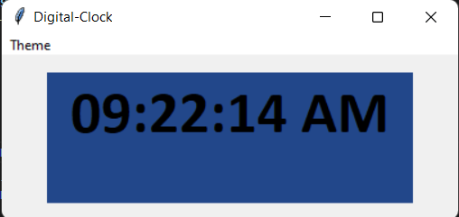

# Digital Clock using Python and Tkinter
This script create a digital clock as per the system's current time.

### Tech Stack:
+ Python

### Libraries used:
+ tkinter
+ time

###  Pre-requirements:
+ `pip install tkinter`

### To execute the project:
+ Run `digital_clock.py.py`

### Screenshot

