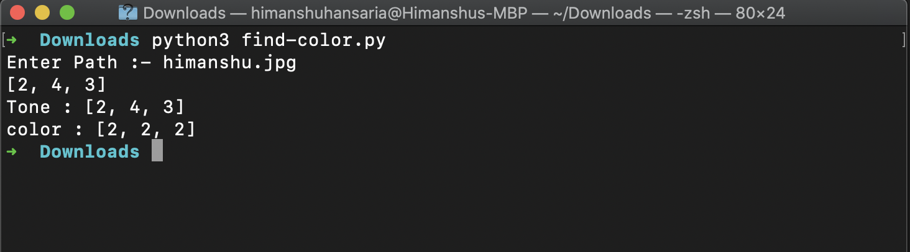

# Finding Dominant Color

### Tech Stack:
+ Python

### Libraries used:
+ cv2
+ numpy

###  Pre-requirements:
+ You only need to have installed opencv which is used for image preprocesssing.
+ `pip install -r requirements.txt`

### To execute the project:
+ Run `find-color.py`
+ Now Enter the path for image
+ Copy Your image path and enter in the command

### Screenshot

