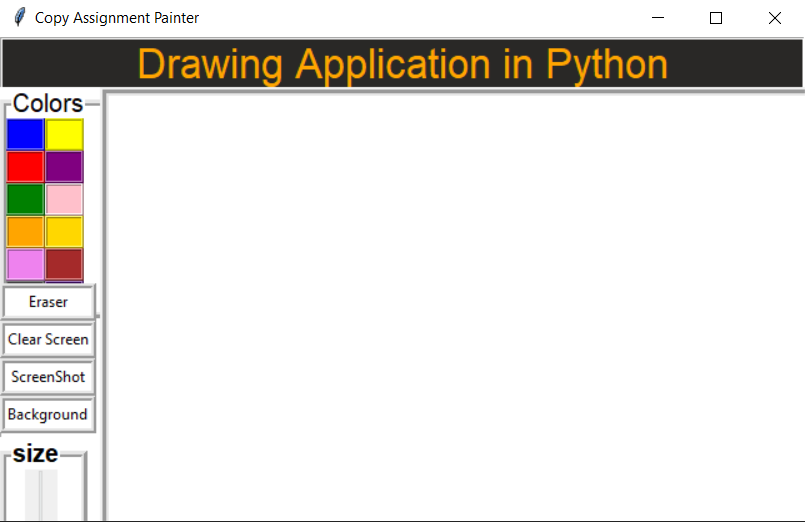

# Drawing Appliaction using Python
Python script to Generate random Password in using GUI 

### Tech Stack:
+ Python

### Libraries:
+ tkinter
+ PIL
+ pillow

### To execute the project:
+ install requirements.txt file `pip install -r requirements.txt`
+ upgrade pip if required `python -m pip install --upgrade pip`
+ Execute `python draw.py`

### Screenshot/Output:

