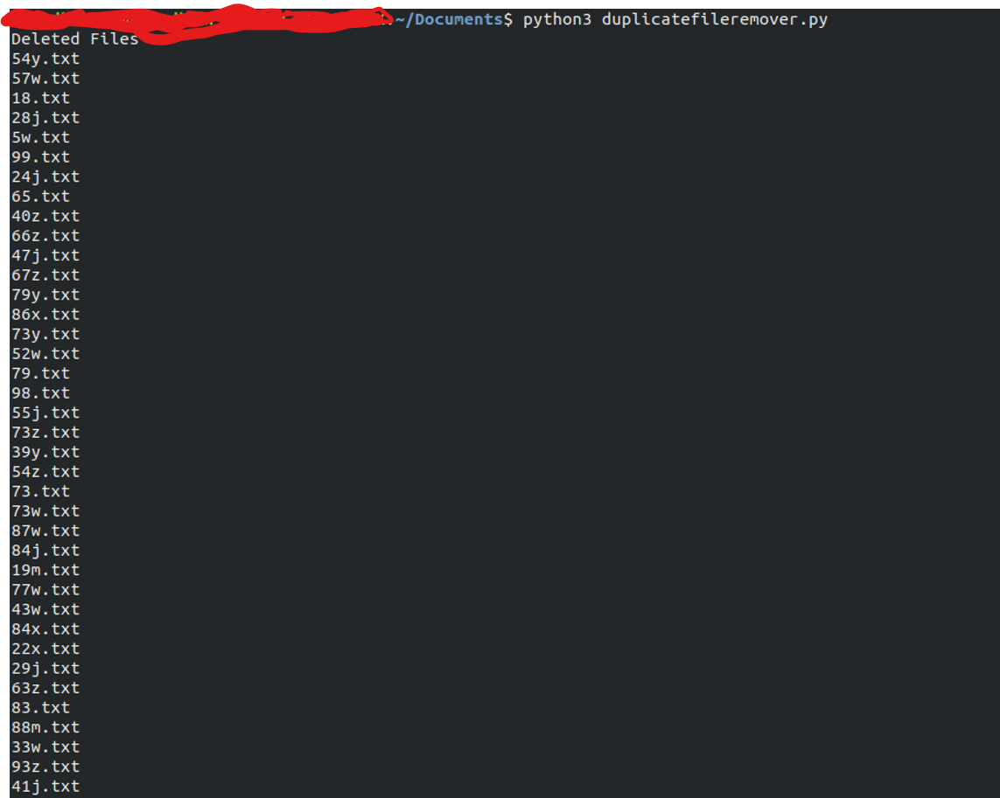

# Duplicate File Remover
This script removes duplicate files in the directory where the script runs.

### Tech Stack:
+ Python

### Libraries used:
+ hashlib
+ os

###  Pre-requirements:
+ none

### To execute the project:
+ Run `duplicatefileremover.py`

### Screenshot:

### How it works:
The script first lists all the files in the directory. It takes MD5 hash of each file, when hash of 2 files become same it deletes the file.
