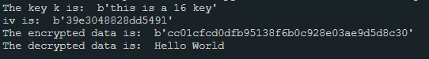

# Encrypt and Decrypt
A small python program that encodes and decodes text.

### Tech Stack:
+ Python

### Libraries used:
+ Crypto
+ binascii

###  Pre-requirements:
+ install `pip install -r requirements.txt`

### To execute the project:
+ Run `encrypy_decrypt.py`

### how to execute:
+ python `encrypy_decrypt.py` "a text"

Example:
```
` python aes_encode.py "hello world" `
```
An encrypted file (`encrypted.bin`) will be generated
when the program has finished running.

### Output/ Screenshot:

