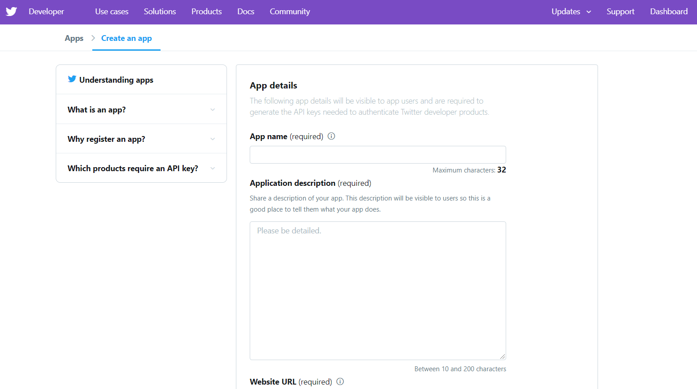
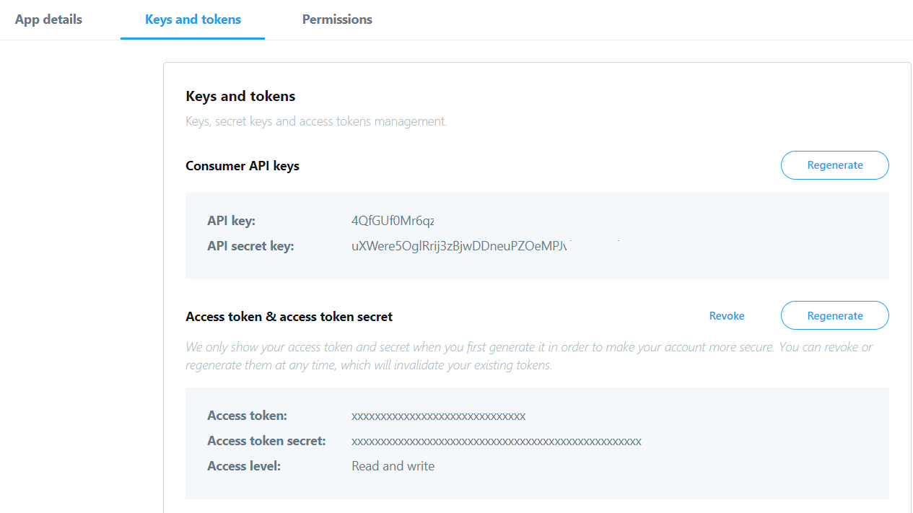

# Fetch and Store Tweets
This python script is used to fetch the required number of tweets of a particular Hashtag through your twitter account and  generates an `.csv` file.

### Tech Stack:
+ Python

### Libraries used:
+ tweepy
+ csv

###  Pre-requirements:
+ install `pip install -r requirements.txt`

### To execute the project:
+ Run `python fetch_store_tweet.py`

### How to execute:
- To execute this script you have to get the API keys from twitter developer account by creating an app at [Twitter developer account](https://developer.twitter.com/apps). For creating an app at  [Twitter developer account](https://developer.twitter.com/apps) you have to follow the below steps

  + step 1: Visit [Twitter Developer Account Website](https://developer.twitter.com/apps) and click on Create app as shown below
  

  + step 2: Click on Apply
    

  + step 3: Based on your choice select the Reason for using twitter developer tools and Click on Next
  

  + step 4: Enter your country and what you would you call and Click on Next
  

  + step 5: Now Carefully read the questions and answer all the questions as per the requirement. Because based on you answer only the account approval will be taken place
  

  + step 6: If your account successfully approved you can come to homepage  [Twitter developer account](https://developer.twitter.com/apps) and now click on Create an app icon on the right top.

  **Note:** sometimes it takes time to approval of the developer account based on step-5 answers
  

  + step 7: Fill the require fields and click on Create
  

  + step 8: After creating the App click on **Keys and tokens** option you will observe Consumer and Access token keys. Copy them and paste them in the python script
  

### Output/ Screenshot:
1. Output 1:
    

2. Output 2:
    
