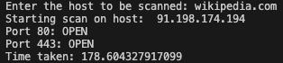

# Fetch open port
This script finds open port for web address.

### Tech Stack:
+ Python

### Libraries used:
none

###  Pre-requirements:
none

### To execute the project:
+ Run `python open_port.py`

### how to execute:
1. Clone repo on your local machine and switch to script folder
```
    git clone https://github.com/punithmadaiahkumar/Python-Mini-Projects.git
    cd python-mini-projects/projects/Fetch_open_ports/
```

2. Run following command
```
    python3 open_port.py
```

3. Once script is running, you can write any website you want, and it will print all open ports in range 50-500.

### Output/ Screenshots:

