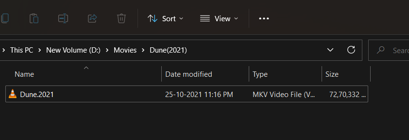
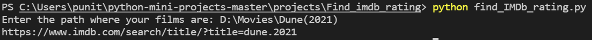

# Find IMDB Ratings
This script is used to fetch the Ratings and Genre of the films in your films folder that match with ones on IMDb, the data is scraped from IMDB's official website and store in a csv file. The csv file can be used for analysis then, sorting acc to rating etc.

### Tech Stack:
+ Python

### Libraries used:
+ bs4 (BeautifulSoup)
+ requests
+ pandas
+ os

###  Pre-requirements:
+ Run `pip install -r requirements.txt`

### To execute the project:
+ Run `python find_IMDb_rating.py`

### how to execute:
+ Install the requirements.
+ Inside the find_IMDb_rating.py, update the directory path.
+ Type the following command: python find_IMDb_rating.py
+ A csv file with rating will be created in the same directory as the python file.

### Output/ Screenshots:
+ Directory

+ Path

+ Output

