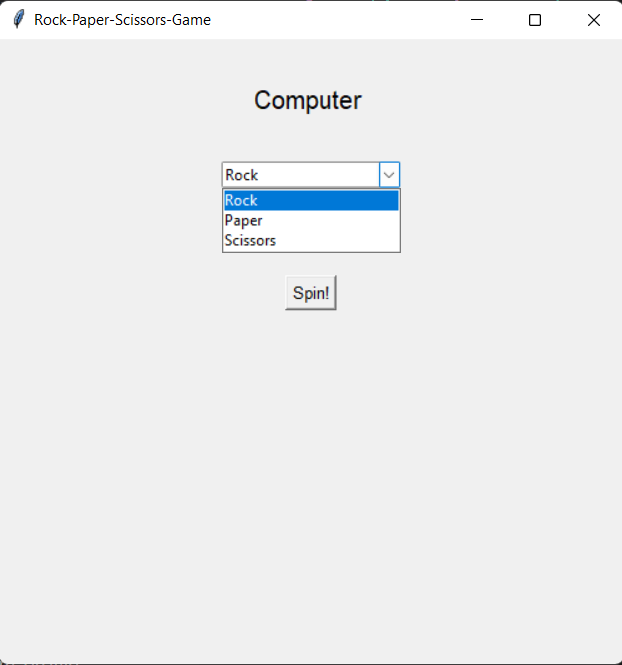

# Rock Paper Scissors Game GUI

### Tech Stack:
+ Python

### Libraries used:
+ tkinter
###  Pre-requirements:
+ Run `pip install tkinter`

### To execute the project:
+ Run `python game.py`

### Screenshot/ Output:

