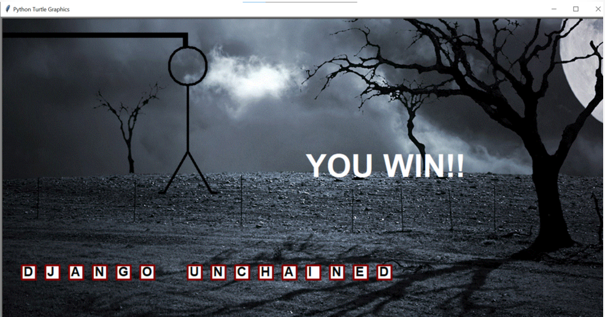

# The Hangman Game using Python
+ The Hangman: In the context of the hanging man, we need to give the player a visual aid.
+ Word Display: The word must be presented at the beginning of the game as blanks rather than letters.

### Tech Stack:
+ Python

### Libraries:
+ random
+ turtle
+ sys
+ time 

### To execute the project:
+ install requirements.txt file `pip install -r requirements.txt`
+ upgrade pip if required `python -m pip install --upgrade pip`
+ Execute `python game.py`

### Screenshot/Output:
