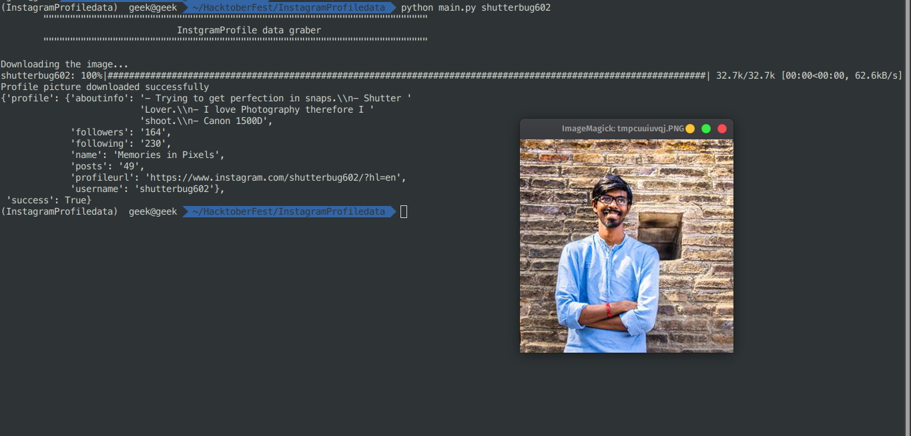

# Instgram profile information

### Tech Stack:
+ Python

### Libraries used:
+ request
+ lxml
+ pprint
+ profilepic

###  Pre-requirements:
+ Run `pip install -r requirements.txt`

### To execute the project:
+ Run `python InstgramProfile.py`

### Screenshot/Output:

