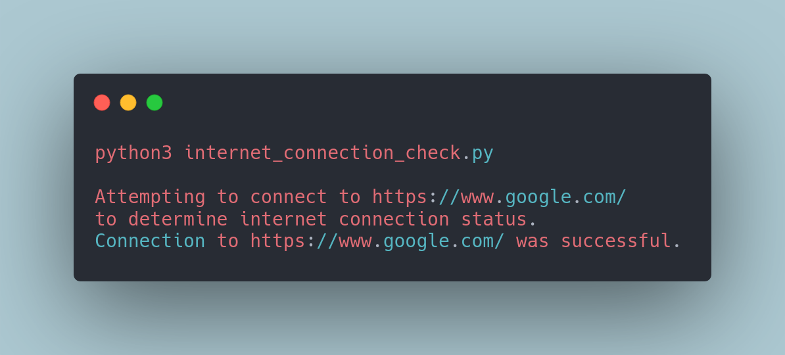

# Internet Connection Check
A small python script to check internet connectivity.
### Tech Stack:
+ Python

### Libraries used:
+ request

###  Pre-requirements:
None

### To execute the project:
+ Run `python internet_connection_check.py`

### Screenshot/Output:

