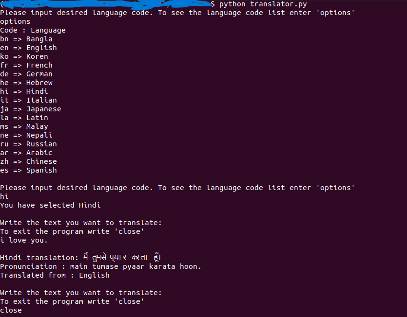

# Language Translator
Translate one language to another language
### Tech Stack:
+ Python

### Libraries used:
+ googletrans

###  Pre-requirements:
+ install `pip install -r requirements.txt`

### To execute the project:
+ Run `python internet_connection_check.py`
+ Select the Language code
+ Enter Sentence and you will get translated language

### Language options and their code
| Code      | Language |
| ----------- | ----------- |
| bn       |       Bangla       |
| en       |       English       |
| ko       |       Korean       |
| fr       |       French       |
| de       |       German       |
| he       |       Hebrew       |
| hi       |       Hindi       |
| it       |       Italian       |
| ja       |       Japanese       |
| la       |       Latin       |
| ms       |       Malay       |
| ne       |       Nepali       |
| ru       |       Russian       |
| ar       |       Arabic       |
| zh       |       Chinese       |
| es       |       Spanish       |

### Screenshot/Output:

