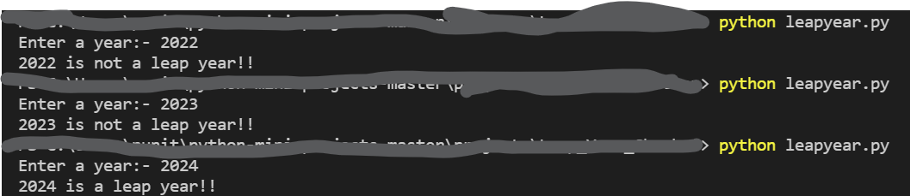

# Leap Year Checker
With the help of this program, you can check whether a year is leap year or not.
### Tech Stack:
+ Python

### Libraries used:
none

###  Pre-requirements:
none

### To execute the project:
+ Run `python leapyear.py`

### Screenshot/Output:

