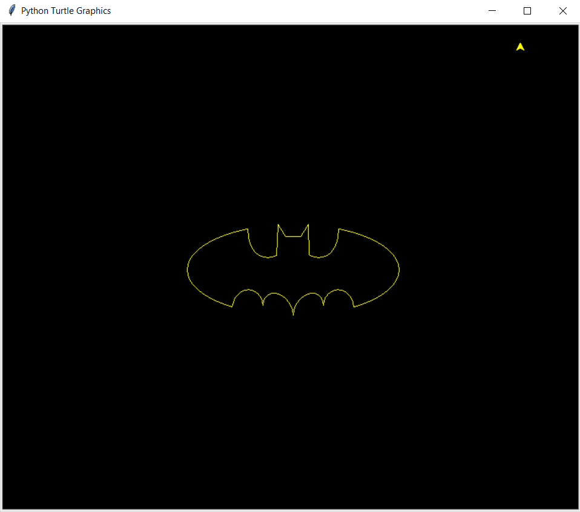
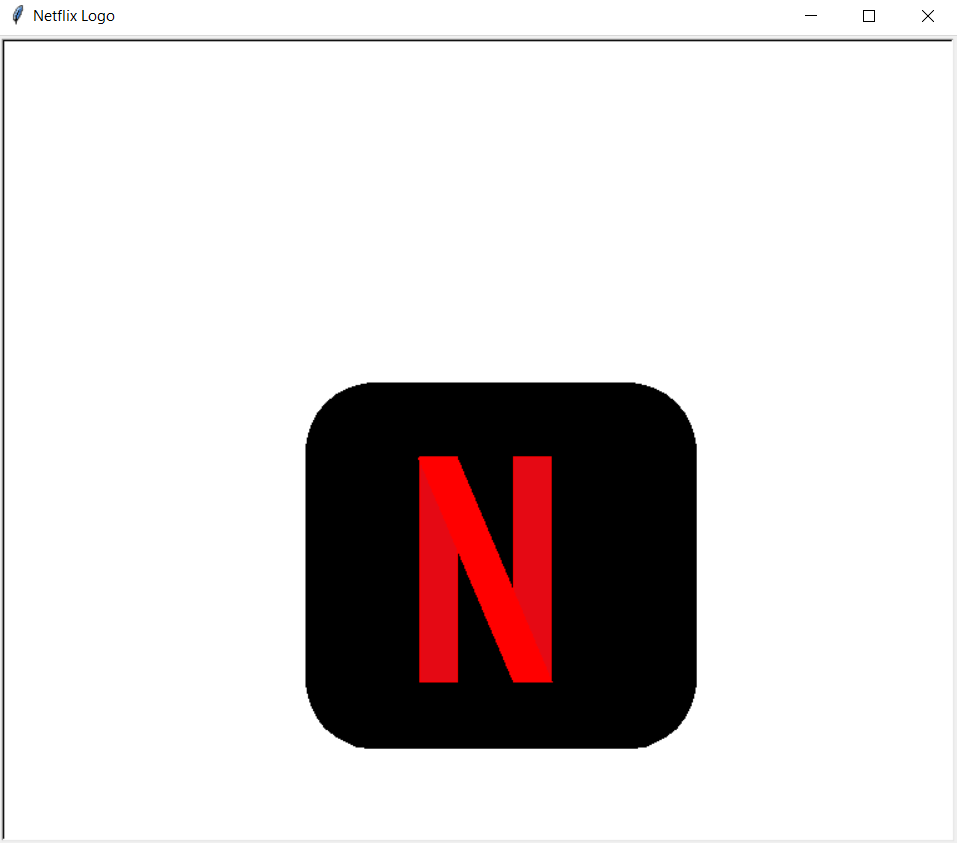

# Logo_Creator
Python script for creating Logo

### Tech Stack:
+ Python

### Libraries used:
+ turtle

### To execute the project:
+ Run `python batman_logo.py`
+ Run `python google_logo.py`
+ Run `python ironman_logo.py`
+ Run `python netflix_logo.py`
+ Run `python windows_logo.py`

### Output/ Screenshot

