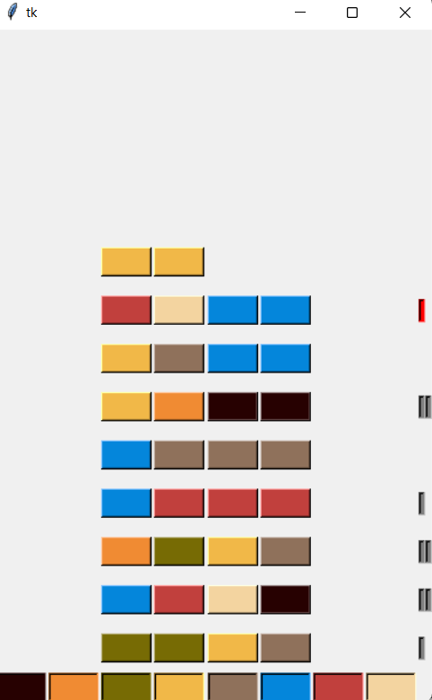

# Master Mind Game
The Python program uses tkinter interface to create a GUI-based simulation of the MasterMind game.

### Tech Stack:
+ Python

### Libraries used:
+ tkinter

###  Pre-requirements:
+ install `pip install -r requirements.txt`

### To execute the project:
+ Run `python Mastermind_GUIinterface.py`

### Screenshot/Output:

