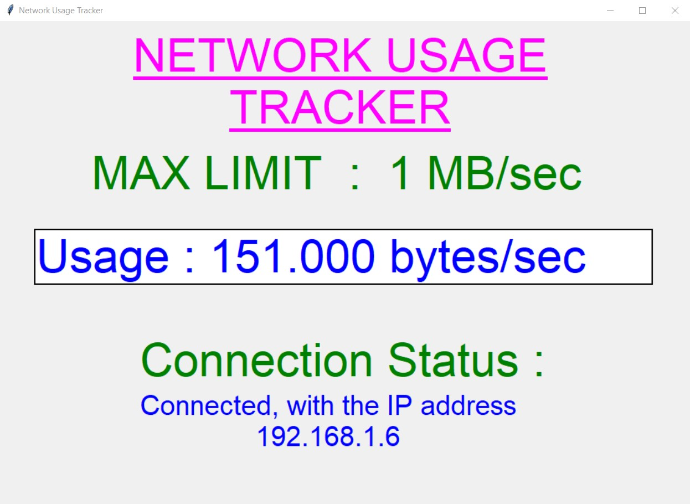
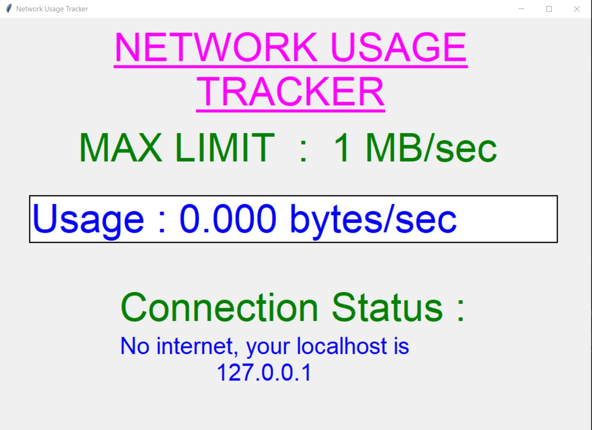

# Network Usage Tracker
+ A "Network Usage Tracker" is an application created in python with tkinter gui.
+ In this application, user gets the usage of network in his/her PC or computer at every instant.
+ Here user will be given a MAX LIMIT of network usage, and if user crosses that max limit, user willl be notified for the same.
+ Also user will be able to see the connection status and the IP address related to the same.

### Tech Stack:
+ Python

### Libraries used:
+ tkinter
+ pil
+ psutil
+ socket

###  Pre-requirements:
+ install `pip install -r requirements.txt`

### To execute the project:
+ Clone the code file 
+ Install requirements file
+ Run `network_usage_tracker.py`

### Screenshot/ Output:

   
   
   
   
   
   
   
   

