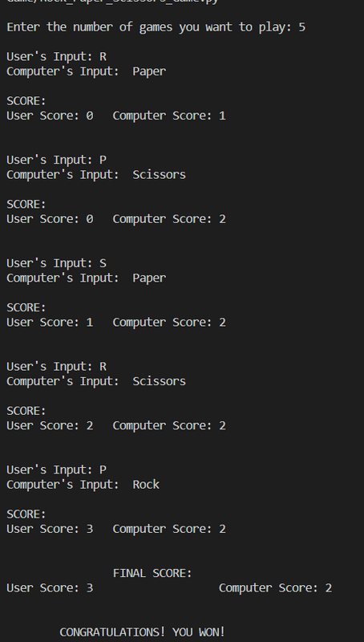

# A Simple Rock Paper Scissors Game:
Script to play rock paper scissor game

### Tech Stack:
+ Python

### To execute the project/play:
+ You can enter the number of games you want to play.
+ You can enter the number of games you want to play.
+ Run `reduce_image_size.py`

### Output/ Screenshot
