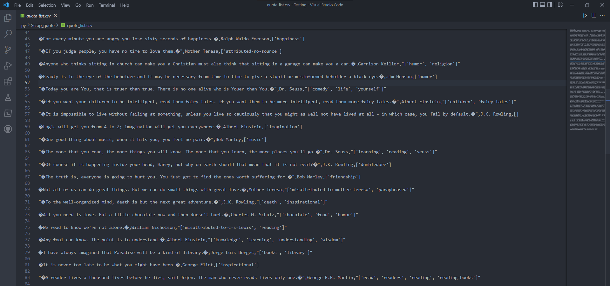

# Quote Scraper
This script scrapes quotes from [Quotes to Scrape](http://quotes.toscrape.com)

### Tech Stack:
+ Python

### Libraries:
+ beautifulsoup4
+ requests

### To execute the project/play:
+ Run `pip install -r requirements.txt`
+ Execute `python3 quote_scraper.py`

### Output/Sceenschot:
