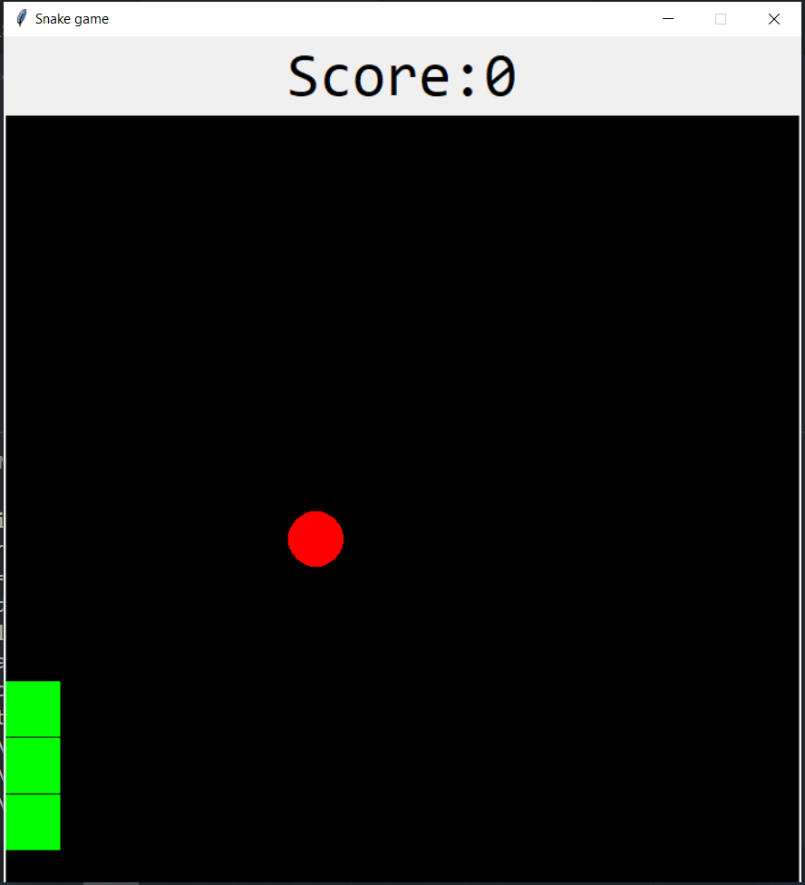

# Snake Game
The Script is developer to play Snake game using tkinter library.

### Tech Stack:
+ Python

### Libraries:
+ tkinter
+ random

### To execute the project/play:
+ Run `pip install -r requirements.txt`
+ Execute `python snake_game.py`

### Output/ ScreenShot:
