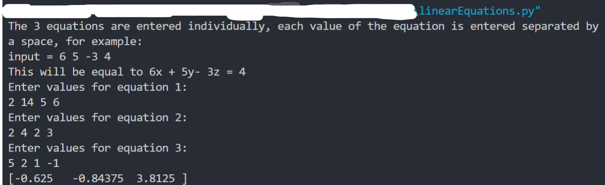
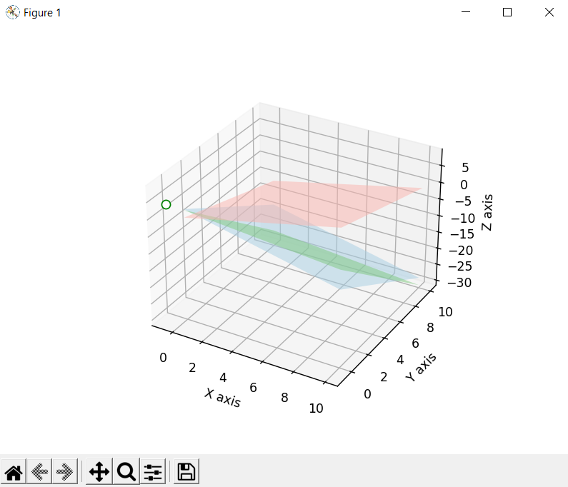

# Solver linear equations
The Script is developed to view three equation solution in a 3D graph.

### Tech Stack:
+ Python

### Libraries:
+ numpy
+ matplotlib
+ mpl_toolkits.mplot3d

### To execute the project/play:
+ Run `pip install -r requirements.txt`
+ Enter values through spaces for each of the three equations, return the solution and a 3D graph.
    - eq.1 `2 14 5 6`
    - eq.2 `2 4 2 3`
    - eq.3 `5 2 1 -1`
+ Execute `python linearEquations.py`

### Output/ ScreenShot:

