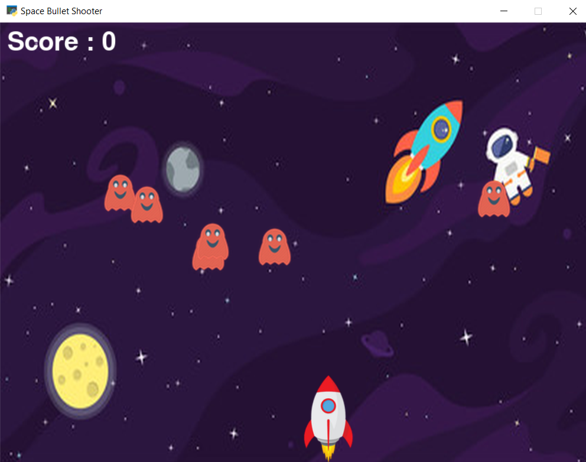

# A Simple Space Bullet Shooter Game
The Script is developed to play Space Bullet Shooter Game.

### Tech Stack:
+ Python

### Libraries:
+ pygame
+ random(built-it)
+ math(built-it)
+ time(built-it)

### To execute the project/play:
+ Run `pip install -r requirements.txt`
+ Execute `python shooter.py`

### Output/ ScreenShot:

