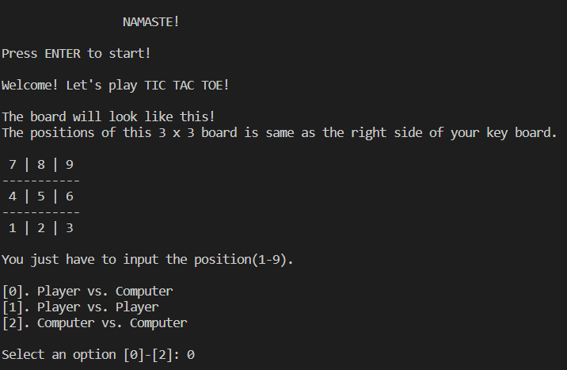
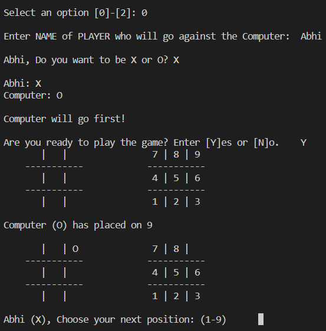

# Tic Tac Toe with AI

### 3 modes:
- Player vs. Player (2 - player mode)
- Player vs. AI (1 - player mode)
- AI vs. AI (*for fun*)

### To view this project on a live terminal:
- Click [here.](https://repl.it/github/tusharnankani/Tic-Tac-Toe-AI)
- And then, click on <kbd>Run</kbd>!

### Tech Stack:
+ Python

### Libraries:
+ Use any Python online compiler of download python IDE from [Python](https://www.python.org/)

### To execute the project:
+ Execute `tic-tac-toe-AI.py`

### Screenshot/Output:

