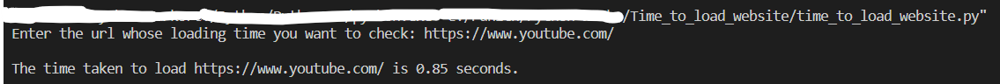

# Time to load website 
This script takes a url from the user and returns the time taken to load that website.

### Tech Stack:
+ Python

### Libraries:
+ urllib
+ time

### To execute the project:
+ Execute `python time_to_load_website.py`

### Screenshot/Output:
