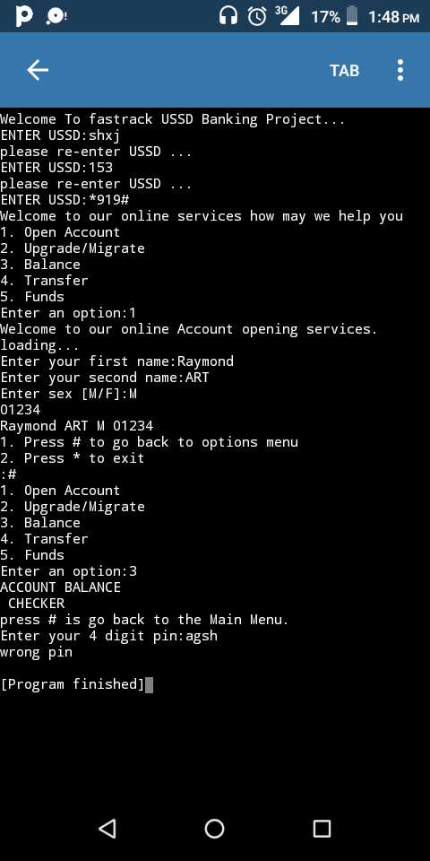

# USSD
Unstructured Supplementary Service Data (USSD), sometimes referred to as "Quick Codes" or "Feature codes", is a communications protocol used by GSM cellular telephones to communicate with the mobile network operator's computers. USSD can be used for WAP browsing, prepaid callback service, mobile-money services, location-based content services, menu-based information services, and as part of configuring the phone on the network

### Tech Stack:
+ Python

### Libraries:
+ random
+ time
+ sys

### To execute the project:
+ Execute `python ussdtim.py`

### Screenshot/Output:
