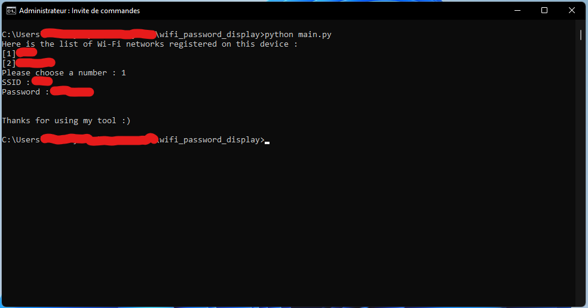

# Windows Wi-Fi password displayer
Python script to display Wi-Fi Password in Windows 

### Tech Stack:
+ Python

### Libraries:
+ glob
+ os 
+ subprocess 
+ xml

### To execute the project:
+ Execute `python main.py`

### Screenshot/Output:
