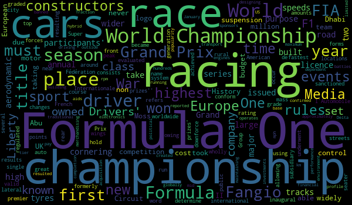

# Wordcloud Images for Wikipedia Article
Python script that prompts the user for an input, searches for the corresponding article on wikipedia and generates a wordcloud based on the searched article.

### Tech Stack:
+ Python

### Libraries:
+ wordcloud
+ matplotlib
+ wikipedia
+ sys
+ warnings

### Pre requirements:
+ install requirements.txt file `pip install -r requirements.txt`

### To execute the project/play:
+ Execute `wiki-search-cloud.py`

### Screenshot/Output:
+ 