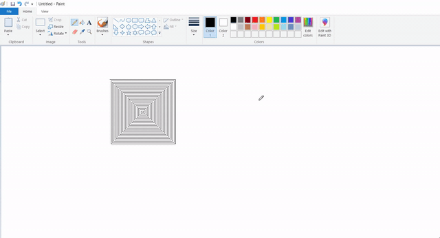
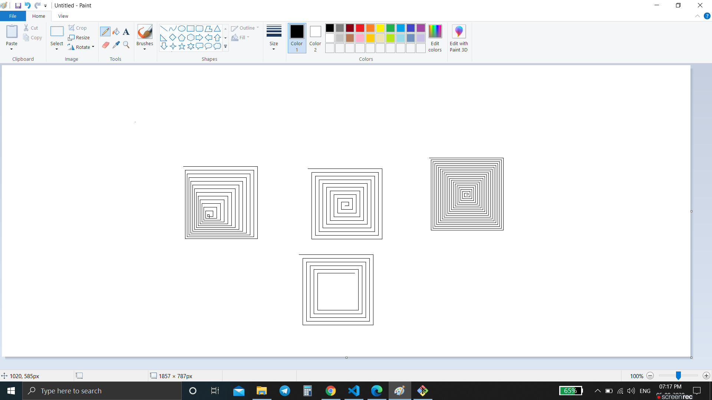

# Python Auto Draw
THIS SIMPLE PROJECT WAS MADE TO LEARN PYTHON LIBRARY FUNCTIONS LIKE `pyatogui` & `time`.

### Tech Stack:
+ Python

### Libraries used:
+ pyautogui

### To execute the project/ Requirements:
+ Python 3.1 or more required, click [here](https://www.python.org/downloads/) to install!.
+ Install `pip install -r requirements.txt` 
+ Run `python python-auto-draw.py`

### Demo: 

### Output/ Screenshot:

### Basics:
+ Get the size of the primary monitor: `screenWidth, screenHeight = pyautogui.size()` 
+ Get the XY position of the mouse. `currentMouseX, currentMouseY = pyautogui.position()`
+ Move the mouse to XY coordinates. `pyautogui.moveTo(100, 150)`
+ Click the mouse. `pyautogui.click()`
+ Move the mouse to XY coordinates and click it. `pyautogui.click(100, 200)`
+ Find where button.png appears on the screen and click it. `pyautogui.click('button.png')`
+ Move mouse 10 pixels down from its current position. `pyautogui.move(0, 10)`
+ Double click the mouse. `pyautogui.doubleClick()`
+ Use tweening/easing function to move mouse over 2 seconds. `pyautogui.moveTo(500, 500, duration=2, tween=pyautogui.easeInOutQuad)`
+ type with quarter-second pause in between each key `pyautogui.write('Hello world!', interval=0.25)`
+ Press the Esc key. All key names are in pyautogui.KEY_NAMES `pyautogui.press('esc')`
+ Press the Shift key down and hold it. `pyautogui.keyDown('shift')`
+ Press the left arrow key 4 times. `pyautogui.press(['left', 'left', 'left', 'left'])`
+ Let go of the Shift key. `pyautogui.keyUp('shift')`
+ Press the Ctrl-C hotkey combination. `pyautogui.hotkey('ctrl', 'c')`
+ Make an alert box appear and pause the program until OK is clicked. `pyautogui.alert('This is the message to display.')`

### Refrence Doc:
+ [PyAutoGUI Docs](https://pypi.org/project/PyAutoGUI/)  
+ [More about PyAutoGUI](https://pyautogui.readthedocs.io/en/latest/mouse.html#mouse-drags)